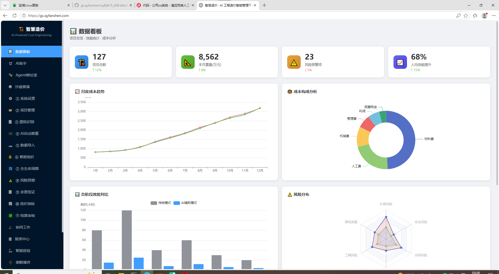

# 智慧造价 · AI 工程造价智能管理平台

> AI 驱动的工程造价与项目成本管理

> 🚀 **[在线演示](https://gc.qyfanshen.com)** · 📚 **[文档](docs/)** · 📋 **[快速开始](docs/QUICKSTART.md)** · 🐛 **[反馈问题](https://github.com/qyfanshen/gc.qyfanshen/issues)** · ⭐ **[Star](https://github.com/qyfanshen/gc.qyfanshen)**


<p align="center">
  <a href="https://github.com/qyfanshen/gc.qyfanshen"></a>
  <a href="https://github.com/qyfanshen/gc.qyfanshen/actions"></a>
  <a href="https://img.shields.io/github/languages/code-size/qyfanshen/gc.qyfanshen"></a>
  <a href="https://github.com/qyfanshen/gc.qyfanshen/issues"></a>
  <a href="https://github.com/qyfanshen/gc.qyfanshen"></a>
</p>

---

**智慧造价** 为工程造价团队提供 AI 辅助估算、工程量计算与项目成本管控，登录保护的控制台并附带模板与工程素材。

[English](README.md) | [中文](README.zh.md)

## 核心使用场景

- **🏗️ 工程造价估算** — AI 辅助的造价估算与预算管理，覆盖工程全流程。
- **📐 工程量计算** — 数字化算量与计价流程，减少人工误差。
- **🔒 角色化门户** — 登录保护的控制台，面向项目方与造价团队。

## 特色功能

### 核心功能
- AI 辅助造价估算流程演示
- 附带工程素材：PPTX 模板
- SEO 就绪：sitemap.xml、robots.txt、语义化标签
- 内置隐私与法律页面
- MIT 协议
- Nginx / Apache 静态部署

### 技术特性
- 现代化技术栈：HTML5 · CSS3 · Vanilla JavaScript · Nginx/Apache
- 隐私与安全：HTTPS 强制、安全响应头、敏感文件隔离
- SEO 就绪：`sitemap.xml`、`robots.txt`、语义化标签
- 许可证：MIT

## 截图预览

实地登录后台的真实截图：

### 数据看板（登录后）


### AI 通用造价助手


---

## 快速部署

> **环境要求**：Python 3.8+（Windows 使用 `python`，Linux/macOS 使用 `python3`）
>
> **Windows 提示**：如 `git clone` 报 `unable to checkout working tree`，先执行 `git config --global core.autocrlf false` 再克隆。

三行命令即可启动：

```bash
git clone https://gitee.com/qyfanshen/gc.qyfanshen.git
cd gc.qyfanshen.com
python3 -m http.server 8080   # open http://localhost:8080
```

> 完整步骤（Nginx、环境变量、生产部署）见 [docs/DEPLOYMENT.md](docs/DEPLOYMENT.md)。
## 常见问题（Troubleshooting）

- **`git clone` 报 `unable to checkout working tree`**：Windows 换行符兼容问题，先执行 `git config --global core.autocrlf false` 再克隆。
- **`python3` 不是内部或外部命令**：Windows 使用 `python -m http.server 8080`（或 `py -m http.server 8080`）。
- **端口 8080 被占用**：换端口，如 `python -m http.server 8000`，然后访问 `http://localhost:8000`。
- **页面显示 404**：确认已进入项目目录（`cd` 到含 `index.html` 的文件夹）再启动服务。
- **浏览器打不开 localhost**：确认防火墙允许 Python 监听本地端口，或换用 `--bind 0.0.0.0`。

## 演示账号

- **演示账号**：`admin` / `123456`（首次登录自动注册）
- 登录入口：首页顶部「进入系统」按钮
- 登录后即可查看数据看板与 AI 造价助手

## 使用指南

1. 配置环境（PHP 站填写 `.env`，静态站配置部署参数）
3. 静态站：直接将目录部署到 Nginx / CDN
4. 访问首页，确认落地页正常渲染
5. （如适用）登录 `/admin/` 检查数据

## 项目结构

```
gc.qyfanshen.com/
├── README.md            # 英文说明
├── README.zh.md         # 本文件（中文说明）
├── AGENTS.md            # AI 协作说明
├── TODO.md              # 路线图与待办
├── CHANGELOG.md         # 版本历史
├── CONTRIBUTING.md      # 贡献指南
├── LICENSE              # MIT 许可证
├── index.html           # 入口页
├── privacy.html         # 隐私政策页
├── screenshots/         # 视觉素材
│   ├── README.md
│   └── preview.png
├── docs/                # 补充文档
│   ├── QUICKSTART.md
│   ├── ARCHITECTURE.md
│   ├── DEPLOYMENT.md

└── .github/             # Issue 模板与 CI 工作流
    ├── ISSUE_TEMPLATE/
    ├── workflows/ci.yml
    └── PULL_REQUEST_TEMPLATE.md
```

## 架构说明

## 概述

- **项目**：智慧造价 · AI 工程造价智能管理平台
- **类型**：静态落地站（附 CAD 素材）
- **技术栈**：HTML5 · CSS3 · Vanilla JavaScript · Nginx/Apache

## 模块划分


## 数据流

```
[Browser]
   │
   ├─── 静态资源（Nginx / CDN）
   │


   │
   └─── /admin/*（如适用）
```

## 安全设计

- HTTPS 强制（301 跳转）
- 安全响应头：CSP / X-Frame-Options / Referrer-Policy / Permissions-Policy
- 敏感文件（`.env`、`*.bak.*`、`storage/`、`.user.ini`）通过 `.gitignore` + Nginx deny 双重保护
- 接口限流（PHP 站 `api/rate_limit.php`）
- CSRF token 校验（PHP 站 `includes/csrf.php`）

## 开发指南

- 按项目约定进行 lint / format
- 提交前运行 `git status` 自检
- 遵守 `.env.example` 中的安全约定

## 部署

## 生产部署

### 1. Nginx 站点配置（推荐）

```nginx
server {
    listen 80;
    server_name gc.qyfanshen.com;
    return 301 https://$server_name$request_uri;
}

server {
    listen 443 ssl http2;
    server_name gc.qyfanshen.com;

    ssl_certificate     /etc/nginx/ssl/smartgc.crt;
    ssl_certificate_key /etc/nginx/ssl/smartgc.key;

    root /var/www/gc.qyfanshen.com;
    index index.html index.php;

    # 安全头
    add_header X-Frame-Options "SAMEORIGIN" always;
    add_header X-Content-Type-Options "nosniff" always;
    add_header Referrer-Policy "strict-origin-when-cross-origin" always;
    add_header Permissions-Policy "geolocation=(), microphone=(), camera=()" always;

    # 静态资源缓存
    location ~* \.(css|js|jpg|jpeg|png|gif|svg|woff2?)$ {
        expires 7d;
        add_header Cache-Control "public, max-age=604800, immutable";
    }

    

    # 禁止访问敏感文件
    location ~ /(\.env|\.user\.ini|\.htaccess|\.bak\.|composer\.json|composer\.lock|package\.json|\.git) {
        deny all;
        return 404;
    }
}
```

### 2. Apache `.htaccess`

```apache
RewriteEngine On
RewriteCond %{HTTPS} !=on
RewriteRule ^(.*)$ https://%{HTTP_HOST}%{REQUEST_URI} [L,R=301]

<IfModule mod_headers.c>
    Header set X-Frame-Options "SAMEORIGIN"
    Header set X-Content-Type-Options "nosniff"
    Header set Referrer-Policy "strict-origin-when-cross-origin"
</IfModule>

<FilesMatch "\.(env|user\.ini|htaccess|bak\.|gitignore)$">
    Require all denied
</FilesMatch>
```

### 4. 部署后检查清单

- [ ] HTTPS 已生效（浏览器锁图标）
- [ ] `https://gc.qyfanshen.com/.env` 返回 404
- [ ] 安全响应头可在 https://securityheaders.com 验证为 A 或 A+
- [ ] sitemap.xml 可访问
- [ ] robots.txt 可访问
- [ ] 隐私页 `privacy.html` 可访问

## 行为准则

请阅读我们的[行为准则](CODE_OF_CONDUCT.md)——友善待人，互相尊重。

## 安全

发现安全漏洞？💖 非常感谢你负责任地披露！

在报告之前，请先花一分钟看看 [安全政策](SECURITY.md)，这样能帮助我们更快响应，也避免遗漏重要信息。

## 贡献

我们非常欢迎你的贡献！💖

如果你愿意参与，可以先看看 [CONTRIBUTING.md](CONTRIBUTING.md)，并使用 [Issue 模板](.github/ISSUE_TEMPLATE/) 与 [PR 模板](.github/PULL_REQUEST_TEMPLATE.md)，这样我们协作起来会更顺畅。🙏

## 许可证

本项目基于 **MIT 许可证** 开源。

**允许：**
- ✅ 商业使用
- ✅ 修改
- ✅ 分发
- ✅ 再授权
- ✅ 私人使用

**条件：**
- 📄 在软件副本中必须包含原始版权声明和许可证声明

**完整条款：** 详见 [LICENSE](LICENSE) 文件。

## 致谢

- 仓库样式参考 [x007xyz/flycut-caption](https://github.com/x007xyz/flycut-caption)
- 由梵燊集团工程团队构建

## 支持

- 问题反馈：请使用仓库内的 issue 模板
- 站点域名：https://gc.qyfanshen.com

## 联系我们

扫码添加企业微信，获取技术支持、商务咨询或合作洽谈：


其他联系方式：
- 集团主站：<https://qyfanshen.com>
- 问题反馈：请使用仓库内的 issue 模板

---

**版权所有 © 2026 [qyfanshen](https://github.com/qyfanshen)。保留所有权利。**

基于 [MIT 许可证](LICENSE) 开源。
